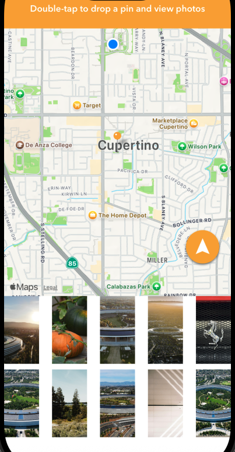
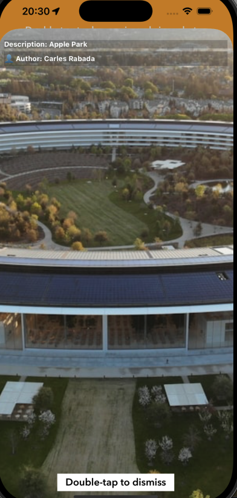

# 📍 PixelCity App

An iOS app that lets users explore real-world locations and instantly view photos from **Unsplash** based on map coordinates.

---

## 🚀 Features

* 🗺️ **Interactive Map:** Double‑tap anywhere to drop a pin.
* 📸 **Photo Fetching:** Automatically loads photos from Unsplash for that coordinate.
* 👤 **Author & Description:** Displays photo metadata.
* 🔍 **Fullscreen Viewer:** Tap a photo to enlarge it.
* 👆 **Double‑tap to close** fullscreen view.
* 🎯 **User Location Tracking.**

---

## 📱 Screenshots

Below are preview screens of the app:

### 🗺️ Map View

Shows your location, allows dropping pins, and displays a bottom photo strip.



### 🖼️ Fullscreen Photo View

Displays selected image with description and author.



---

## 🛠️ Technologies Used

* **Swift**
* **MapKit** (for map and location handling)
* **Unsplash API** (for fetching images)
* **URLSession / JSON Decoding**
* **UIKit**

---

## 📦 Installation

1. Clone the project:

   ```bash
   git clone https://github.com/YourUsername/PixelCity.git
   ```
2. Open the project in Xcode:

   ```bash
   open PixelCity.xcodeproj
   ```
3. Run on Simulator or Device.

---

## 🔑 API Key Setup

This app uses the Unsplash API.

1. Create a free account at **unsplash.com/developers**.
2. Get your **Access Key**.
3. Add your key to `Constants.swift`:

   ```swift
   let UNSPLASH_API_KEY = "YOUR_KEY_HERE"
   ```

---

## 📄 License

This project is for educational purposes.

---

If you want, I can also add:
✅ A badge section (platform, Swift version)
✅ A GIF demo
✅ A features table
Just tell me!

